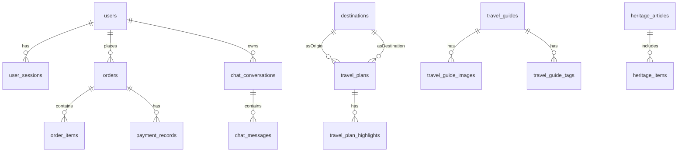

# 东北旅游项目数据库重设计（基于前端反推）

## 1. 目标与原则

基于 `Sonw/snowTravel` 当前前端字段和页面行为，重新设计一版数据库，目标是：

- 对齐前端真实用到的数据结构（登录、用户信息、旅行计划、攻略、非遗、聊天、订单）。
- 结构不过度复杂：核心实体规范化，弱关联内容不过度拆分。
- 便于后续后端接口稳定对接（优先保证 `/auth`、`/profile`、`/search/travel-plan`、`/subjects`、`/articles`、`/chat`）。

设计假设：

- 数据库使用 MySQL 8.x。
- 后端继续使用 Spring Boot + MyBatis。
- 用户体系以若依为主，前端 App 用户复用 `sys_user`。
- 业务表不使用逻辑删除字段（物理删除或业务侧自行控制）。

---

## 2. 前端需求反推（核心对象）

从 `@Sonw/snowTravel` 的页面和 API 抽取到的关键数据：

- 用户：`id`、`phone`、`userName/username`、`name`、`nickname`、`avatar`、`token`
- 旅行计划（列表卡片）：`id`、`title`、`summary`、`origin`、`destination`、`startTime`、`endTime`、`estimatedCostPerPerson`、`highlights[]`
- 攻略专题（subjects）：`id`、`title`、`desc`、`img`、`detail`、`images[]`、`tags[]`
- 非遗文章（articles）：`id`、`title`、`content`、`author`、`publishDate`、`heritageItems[]`
- AI 聊天：发送 `message`，返回 `reply/message`
- 订单与支付（前端导航已预留）：订单列表、下单、支付状态

---

## 3. 推荐 ER 关系（中等复杂度）



---

## 4. 表结构设计（DDL）

> 命名采用小写下划线；`id` 使用 `BIGINT`；时间统一 `DATETIME`。

### 4.1 用户与登录

#### 4.1.1 用户表选择（若依兼容）

- 前端 App 用户 **复用若依** `sys_user`，用 `user_type='01'` 标识 App 用户（后台用户保持 `00`）。
- 登录 token 按若依默认方案（通常 Redis 存储），不额外创建 `user_sessions` 表。

前端字段到 `sys_user` 的映射建议：

| 前端字段 | `sys_user` 字段 | 说明 |
| --- | --- | --- |
| `id` | `user_id` | 主键 |
| `phone` | `phonenumber` | 建议加唯一索引 |
| `username` / `userName` | `user_name` | 账号（可用手机号或规则生成） |
| `nickname` | `nick_name` | 昵称 |
| `avatar` | `avatar` | 头像地址 |
| `password` | `password` | 存 bcrypt（若依默认） |

兼容性补丁（建议）：

```sql
ALTER TABLE sys_user ADD UNIQUE KEY uk_sys_user_phonenumber (phonenumber);
```

```sql
CREATE TABLE users (
  id BIGINT PRIMARY KEY AUTO_INCREMENT,
  phone VARCHAR(20) NOT NULL UNIQUE,
  username VARCHAR(64) NOT NULL,
  password_hash VARCHAR(255) NOT NULL,
  nickname VARCHAR(64) NULL,
  real_name VARCHAR(64) NULL,
  avatar_url VARCHAR(255) NULL,
  status TINYINT NOT NULL DEFAULT 1 COMMENT '1=正常,0=禁用',
  created_at DATETIME NOT NULL DEFAULT CURRENT_TIMESTAMP,
  updated_at DATETIME NOT NULL DEFAULT CURRENT_TIMESTAMP ON UPDATE CURRENT_TIMESTAMP,
  is_deleted TINYINT NOT NULL DEFAULT 0
);

CREATE TABLE user_sessions (
  id BIGINT PRIMARY KEY AUTO_INCREMENT,
  user_id BIGINT NOT NULL,
  token VARCHAR(512) NOT NULL,
  expires_at DATETIME NOT NULL,
  client_ip VARCHAR(45) NULL,
  user_agent VARCHAR(255) NULL,
  created_at DATETIME NOT NULL DEFAULT CURRENT_TIMESTAMP,
  is_deleted TINYINT NOT NULL DEFAULT 0,
  INDEX idx_user_id (user_id),
  INDEX idx_token (token(128)),
  CONSTRAINT fk_user_sessions_user FOREIGN KEY (user_id) REFERENCES users(id)
);
```

### 4.2 目的地与旅行计划

```sql
CREATE TABLE destinations (
  id BIGINT PRIMARY KEY AUTO_INCREMENT,
  city_name VARCHAR(64) NOT NULL,
  province_name VARCHAR(64) NULL,
  region_level TINYINT NOT NULL DEFAULT 2 COMMENT '1=省,2=市',
  sort_order INT NOT NULL DEFAULT 0,
  created_at DATETIME NOT NULL DEFAULT CURRENT_TIMESTAMP,
  updated_at DATETIME NOT NULL DEFAULT CURRENT_TIMESTAMP ON UPDATE CURRENT_TIMESTAMP,
  is_deleted TINYINT NOT NULL DEFAULT 0,
  UNIQUE KEY uk_city_province (city_name, province_name)
);

CREATE TABLE travel_plans (
  id BIGINT PRIMARY KEY AUTO_INCREMENT,
  title VARCHAR(128) NOT NULL,
  summary VARCHAR(1000) NULL,
  origin_destination_id BIGINT NOT NULL,
  target_destination_id BIGINT NOT NULL,
  start_time DATETIME NOT NULL,
  end_time DATETIME NOT NULL,
  estimated_cost_per_person DECIMAL(10,2) NOT NULL DEFAULT 0.00,
  cover_image_url VARCHAR(255) NULL,
  status TINYINT NOT NULL DEFAULT 1 COMMENT '1=上架,0=下架',
  created_at DATETIME NOT NULL DEFAULT CURRENT_TIMESTAMP,
  updated_at DATETIME NOT NULL DEFAULT CURRENT_TIMESTAMP ON UPDATE CURRENT_TIMESTAMP,
  is_deleted TINYINT NOT NULL DEFAULT 0,
  INDEX idx_plan_search (origin_destination_id, target_destination_id, start_time, end_time),
  CONSTRAINT fk_plan_origin FOREIGN KEY (origin_destination_id) REFERENCES destinations(id),
  CONSTRAINT fk_plan_target FOREIGN KEY (target_destination_id) REFERENCES destinations(id)
);

CREATE TABLE travel_plan_highlights (
  id BIGINT PRIMARY KEY AUTO_INCREMENT,
  plan_id BIGINT NOT NULL,
  highlight_text VARCHAR(128) NOT NULL,
  sort_order INT NOT NULL DEFAULT 0,
  created_at DATETIME NOT NULL DEFAULT CURRENT_TIMESTAMP,
  is_deleted TINYINT NOT NULL DEFAULT 0,
  INDEX idx_plan_id (plan_id),
  CONSTRAINT fk_plan_highlight_plan FOREIGN KEY (plan_id) REFERENCES travel_plans(id)
);
```

### 4.3 攻略专题（subjects）

```sql
CREATE TABLE travel_guides (
  id BIGINT PRIMARY KEY AUTO_INCREMENT,
  title VARCHAR(128) NOT NULL,
  short_desc VARCHAR(500) NULL,
  detail_text TEXT NULL,
  location_city VARCHAR(64) NULL,
  cover_image_url VARCHAR(255) NULL,
  status TINYINT NOT NULL DEFAULT 1,
  created_at DATETIME NOT NULL DEFAULT CURRENT_TIMESTAMP,
  updated_at DATETIME NOT NULL DEFAULT CURRENT_TIMESTAMP ON UPDATE CURRENT_TIMESTAMP,
  is_deleted TINYINT NOT NULL DEFAULT 0
);

CREATE TABLE travel_guide_images (
  id BIGINT PRIMARY KEY AUTO_INCREMENT,
  guide_id BIGINT NOT NULL,
  image_url VARCHAR(255) NOT NULL,
  sort_order INT NOT NULL DEFAULT 0,
  created_at DATETIME NOT NULL DEFAULT CURRENT_TIMESTAMP,
  is_deleted TINYINT NOT NULL DEFAULT 0,
  INDEX idx_guide_id (guide_id),
  CONSTRAINT fk_guide_image_guide FOREIGN KEY (guide_id) REFERENCES travel_guides(id)
);

CREATE TABLE travel_guide_tags (
  id BIGINT PRIMARY KEY AUTO_INCREMENT,
  guide_id BIGINT NOT NULL,
  tag_name VARCHAR(64) NOT NULL,
  sort_order INT NOT NULL DEFAULT 0,
  created_at DATETIME NOT NULL DEFAULT CURRENT_TIMESTAMP,
  is_deleted TINYINT NOT NULL DEFAULT 0,
  INDEX idx_guide_tag (guide_id, tag_name),
  CONSTRAINT fk_guide_tag_guide FOREIGN KEY (guide_id) REFERENCES travel_guides(id)
);
```

### 4.4 非遗文章（articles）

```sql
CREATE TABLE heritage_articles (
  id BIGINT PRIMARY KEY AUTO_INCREMENT,
  title VARCHAR(200) NOT NULL,
  content TEXT NOT NULL,
  author_name VARCHAR(64) NULL,
  publish_date DATE NULL,
  cover_image_url VARCHAR(255) NULL,
  status TINYINT NOT NULL DEFAULT 1,
  created_at DATETIME NOT NULL DEFAULT CURRENT_TIMESTAMP,
  updated_at DATETIME NOT NULL DEFAULT CURRENT_TIMESTAMP ON UPDATE CURRENT_TIMESTAMP,
  is_deleted TINYINT NOT NULL DEFAULT 0,
  INDEX idx_publish_date (publish_date)
);

CREATE TABLE heritage_items (
  id BIGINT PRIMARY KEY AUTO_INCREMENT,
  article_id BIGINT NOT NULL,
  item_name VARCHAR(128) NOT NULL,
  item_desc VARCHAR(1000) NULL,
  image_url VARCHAR(255) NULL,
  sort_order INT NOT NULL DEFAULT 0,
  created_at DATETIME NOT NULL DEFAULT CURRENT_TIMESTAMP,
  is_deleted TINYINT NOT NULL DEFAULT 0,
  INDEX idx_article_id (article_id),
  CONSTRAINT fk_heritage_item_article FOREIGN KEY (article_id) REFERENCES heritage_articles(id)
);
```

### 4.5 AI 聊天

```sql
CREATE TABLE chat_conversations (
  id BIGINT PRIMARY KEY AUTO_INCREMENT,
  user_id BIGINT NULL COMMENT '游客可为空',
  title VARCHAR(128) NULL,
  created_at DATETIME NOT NULL DEFAULT CURRENT_TIMESTAMP,
  updated_at DATETIME NOT NULL DEFAULT CURRENT_TIMESTAMP ON UPDATE CURRENT_TIMESTAMP,
  is_deleted TINYINT NOT NULL DEFAULT 0,
  INDEX idx_chat_user (user_id),
  CONSTRAINT fk_chat_conv_user FOREIGN KEY (user_id) REFERENCES users(id)
);

CREATE TABLE chat_messages (
  id BIGINT PRIMARY KEY AUTO_INCREMENT,
  conversation_id BIGINT NOT NULL,
  role_type TINYINT NOT NULL COMMENT '1=user,2=assistant',
  content TEXT NOT NULL,
  created_at DATETIME NOT NULL DEFAULT CURRENT_TIMESTAMP,
  is_deleted TINYINT NOT NULL DEFAULT 0,
  INDEX idx_conv_time (conversation_id, created_at),
  CONSTRAINT fk_chat_msg_conv FOREIGN KEY (conversation_id) REFERENCES chat_conversations(id)
);
```

### 4.6 订单与支付

```sql
CREATE TABLE orders (
  id BIGINT PRIMARY KEY AUTO_INCREMENT,
  order_no VARCHAR(64) NOT NULL UNIQUE,
  user_id BIGINT NOT NULL,
  total_amount DECIMAL(10,2) NOT NULL,
  order_status TINYINT NOT NULL DEFAULT 1 COMMENT '1=待支付,2=已支付,3=已取消,4=已完成',
  contact_name VARCHAR(64) NULL,
  contact_phone VARCHAR(20) NULL,
  created_at DATETIME NOT NULL DEFAULT CURRENT_TIMESTAMP,
  updated_at DATETIME NOT NULL DEFAULT CURRENT_TIMESTAMP ON UPDATE CURRENT_TIMESTAMP,
  is_deleted TINYINT NOT NULL DEFAULT 0,
  INDEX idx_order_user (user_id),
  CONSTRAINT fk_order_user FOREIGN KEY (user_id) REFERENCES users(id)
);

CREATE TABLE order_items (
  id BIGINT PRIMARY KEY AUTO_INCREMENT,
  order_id BIGINT NOT NULL,
  biz_type TINYINT NOT NULL COMMENT '1=travel_plan,2=tour,3=product',
  biz_id BIGINT NOT NULL,
  item_name VARCHAR(128) NOT NULL,
  unit_price DECIMAL(10,2) NOT NULL,
  quantity INT NOT NULL DEFAULT 1,
  travel_date DATE NULL,
  created_at DATETIME NOT NULL DEFAULT CURRENT_TIMESTAMP,
  is_deleted TINYINT NOT NULL DEFAULT 0,
  INDEX idx_order_item_order (order_id),
  CONSTRAINT fk_order_item_order FOREIGN KEY (order_id) REFERENCES orders(id)
);

CREATE TABLE payment_records (
  id BIGINT PRIMARY KEY AUTO_INCREMENT,
  order_id BIGINT NOT NULL,
  payment_channel VARCHAR(32) NOT NULL DEFAULT 'mock',
  payment_status TINYINT NOT NULL DEFAULT 1 COMMENT '1=待支付,2=成功,3=失败',
  transaction_no VARCHAR(64) NULL,
  paid_amount DECIMAL(10,2) NOT NULL DEFAULT 0.00,
  paid_at DATETIME NULL,
  callback_payload TEXT NULL,
  created_at DATETIME NOT NULL DEFAULT CURRENT_TIMESTAMP,
  updated_at DATETIME NOT NULL DEFAULT CURRENT_TIMESTAMP ON UPDATE CURRENT_TIMESTAMP,
  is_deleted TINYINT NOT NULL DEFAULT 0,
  INDEX idx_pay_order (order_id),
  INDEX idx_txn_no (transaction_no),
  CONSTRAINT fk_payment_order FOREIGN KEY (order_id) REFERENCES orders(id)
);
```

---

## 5. 前端接口到新表映射建议

| 前端接口 | 建议主表 | 备注 |
| --- | --- | --- |
| `/auth/register` | `users` | 写入手机号、用户名、密码哈希 |
| `/auth/login/password` | `users` + `user_sessions` | 校验用户并下发 token |
| `/profile/{id}` | `users` | 返回 `name/nickname/avatar/phone` |
| `/search/travel-plan` | `travel_plans` + `destinations` + `travel_plan_highlights` | 按起终点、时间、人数查询 |
| `/subjects` | `travel_guides` | 列表返回 `id/title/short_desc/cover_image_url` |
| `/subjects/{id}` | `travel_guides` + `travel_guide_images` + `travel_guide_tags` | 详情返回 `detail/images/tags` |
| `/articles` | `heritage_articles` | 分页列表 |
| `/articles/{id}` | `heritage_articles` + `heritage_items` | 详情 + 非遗条目 |
| `/chat` | `chat_conversations` + `chat_messages` | 可选落库（建议保留） |
| `/orders` | `orders` + `order_items` | 下单 |
| `/payments/mock/*` | `payment_records` | 支付与回调状态维护 |

---

## 6. 复杂度控制说明（为什么这样设计）

- 没有引入过多通用中间表（例如全站统一 tag 系统），避免过度工程化。
- 对前端需要排序展示的数组（highlights、guide_images、guide_tags、heritage_items）采用“子表 + sort_order”，比 JSON 更好维护。
- 保留订单/支付最小闭环，便于前端“我的订单”后续落地。
- 保留聊天会话与消息两表，后续支持历史记录与上下文。

---

## 7. 分阶段落地建议

### Phase 1（必须先落地）
- `users`、`user_sessions`
- `destinations`、`travel_plans`、`travel_plan_highlights`
- `travel_guides`、`travel_guide_images`、`travel_guide_tags`
- `heritage_articles`、`heritage_items`

### Phase 2（扩展）
- `chat_conversations`、`chat_messages`
- `orders`、`order_items`、`payment_records`

### Phase 3（优化）
- 增加热门搜索、埋点统计、推荐策略等分析型表（可独立库）

---

## 8. 对当前后端改造的最小影响建议

1. 保持现有接口路径不大改，仅调整 DTO 与查询逻辑映射到新表。
2. 优先修复前端路径不一致接口（`/auth/captcha`、`/profile/{id}`）。
3. 将 GET + `@RequestBody` 改为 GET + Query 参数，避免联调兼容问题。
4. 将 mock 支持放到前端环境变量，不再分散在各 API 文件硬编码。

